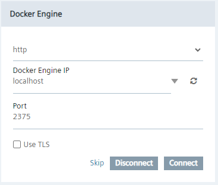
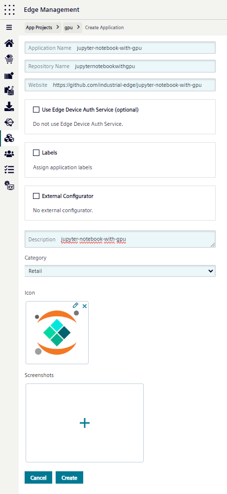
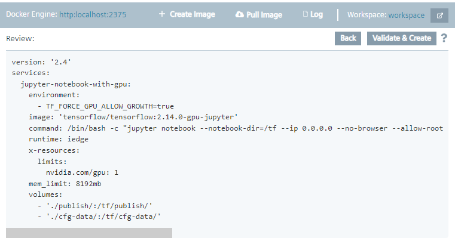
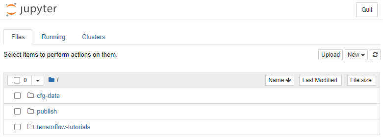
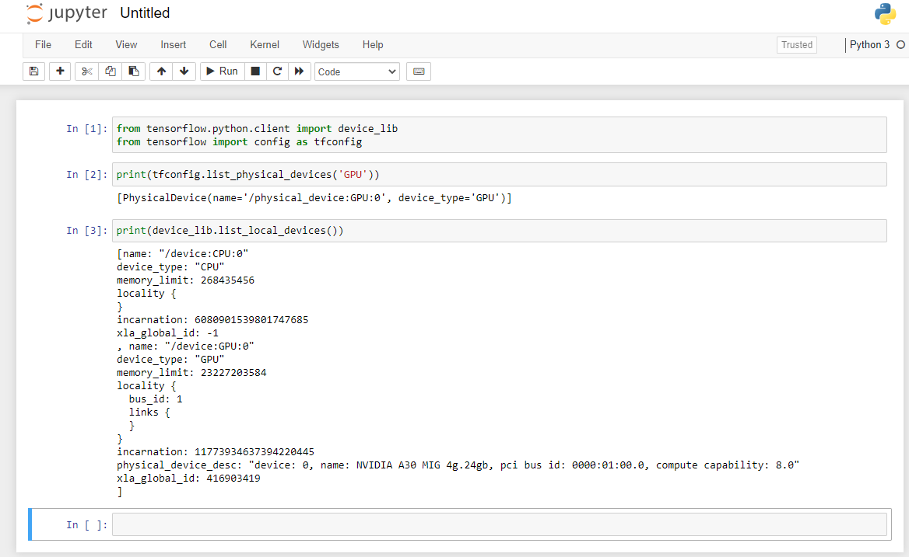

# Jupyter Notebook with GPU <!-- omit from toc -->

## Table of Contents <!-- omit from toc -->

- [Description](#description)
- [Requirements](#requirements)
  - [Prerequisites](#prerequisites)
  - [Used Components](#used-components)
- [Documentation](#documentation)
  - [Using a Stock Container](#using-a-stock-container)
  - [Enabling GPU Access](#enabling-gpu-access)
  - [Adding Options for Industrial Edge](#adding-options-for-industrial-edge)
  - [Creating and Uploading the App](#creating-and-uploading-the-app)
  - [Running the App](#running-the-app)
- [Contribution](#contribution)
- [License and Legal Information](#license-and-legal-information)
- [Disclaimer](#disclaimer)

## Description

This tutorial demonstrates the use of Nvidia GPUs for machine learning on Industrial Edge.
In particular, it shows how to turn an official [TensorFlow](https://www.tensorflow.org) container with [Jupyter notebook server](https://jupyter.org/) into a GPU-accelerated app.
For introductory material and guidance on creating own Industrial Edge apps, please see the [documentation for app developers](https://docs.eu1.edge.siemens.cloud/develop_an_application/index.html).

## Requirements

### Prerequisites

- Nvidia GPU [compatible with Nvidia's OSS drivers](https://github.com/NVIDIA/open-gpu-kernel-modules#compatible-gpus)

### Used Components

- Industrial Edge App Publisher (IEAP) v1.13.5
- Industrial Edge Device Kit (IEDK) v1.16.0-4
- Industrial Edge Device with [GPU support being enabled](https://docs.eu1.edge.siemens.cloud/build_a_device/device_building/development/configuration/capabilitiesjson.html#hostresourcemanager)

## Documentation

### Using a Stock Container

Let us use a stock TensorFlow container that automatically starts the Jupyter notebook server.
The image is `tensorflow/tensorflow:2.14.0-gpu-jupyter`.
It contains all necessary Nvidia support libraries.
Hence, we have as a minimal Docker Compose file:

```yaml
version: '2.4'
services:
  jupyter-notebook-with-gpu:
    image: tensorflow/tensorflow:2.14.0-gpu-jupyter

    mem_limit: 8192mb
```

However, this will not yet grant GPU access to the app as Docker containers cannot access GPUs out-of-the-box.

> [!IMPORTANT]
> Industrial Edge requires a `mem_limit` to be specified.
> If the memory consumption exceeds the limit during runtime, the app is stopped.
> As TensorFlow is very memory-hungry, we use a rather large amount of memory.

### Enabling GPU Access

To enable GPU acceleration, we need to provide GPU access to the `jupyter-notebook-with-gpu` service by means of Industrial Edge's [Resource Manager](https://docs.eu1.edge.siemens.cloud/develop_an_application/developer_guide/resource_manager/06_index.html).
This is accomplished with an `x-resources:limits` entry under the service.
Specifying `nvidia.com/gpu: 1` will claim one Nvidia GPU for exclusive use by this container.
Generally, one can claim an arbitrary number of resources.

> [!NOTE]
> Device names or numbers are not hardcoded, just the number of resource instances of a specific resource class needs to be given.
> Which instances (devices) are actually mapped into the container is decided by the Resource Manager.

Do not forget the `runtime: iedge` entry so that the extension field `x-resources` is handled correctly.
If `runtime: iedge` is missing, the resource claim is ignored, and no GPU is allocated.

```yaml
version: '2.4'
services:
  jupyter-notebook-with-gpu:
    image: tensorflow/tensorflow:2.14.0-gpu-jupyter

    runtime: iedge

    x-resources:
      limits:
        nvidia.com/gpu: 1

    mem_limit: 8192mb
```

### Adding Options for Industrial Edge

To turn the TensorFlow-Jupyter image into an Industrial Edge app, a few specific tweaks are needed:

- By default, Jupyter starts up with a random token which must be specified in the URL.
This needs to be turned off by overriding the initial `command` (we use command line arguments `--NotebookApp.token="" --NotebookApp.password=""`).
- We need an nginx config so that upon icon click, the Jupyter web page (under default port 8888) is opened:
`[{"name":"jupyter-notebook-with-gpu","protocol":"HTTP","port":"8888","headers":"","rewriteTarget":"/jupyter-notebook-with-gpu"}]`.
This makes the app available under URL prefix `tensorflow-jupyter-demo-app`, i.e., the Jupyter app is accessed under `http://<ied-url>/jupyter-notebook-with-gpu`.
At the same time, we need to tell Jupyter to use this URL as root, so that the Jupyter notebook works correctly (`--NotebookApp.base_url=/jupyter-notebook-with-gpu`).
- Moreover, we make the standard volumes `publish` and `cfg-data` available so that Jupyter notebooks can access them.
These are needed to get files into and out of the container and to have persistent storage.

Finally, we obtain the following Docker Compose file (see [docker-compose.example.yml](./docker-compose.example.yml)):

```yaml
version: '2.4'
services:
  jupyter-notebook-with-gpu:
    image: tensorflow/tensorflow:2.14.0-gpu-jupyter

    command: '/bin/bash -c "jupyter notebook --notebook-dir=/tf --ip 0.0.0.0 --no-browser --allow-root --NotebookApp.allow_origin=* --NotebookApp.base_url=/jupyter-notebook-with-gpu --NotebookApp.token=\"\" --NotebookApp.password=\"\" > /tf/publish/jupyter-console.log 2>&1"'

    runtime: iedge

    x-resources:
      limits:
        nvidia.com/gpu: 1

    labels:
      com_mwp_conf_nginx: '[{"name":"jupyter-notebook-with-gpu","protocol":"HTTP","port":"8888","headers":"","rewriteTarget":"/jupyter-notebook-with-gpu"}]'

    mem_limit: 8192mb

    volumes:
      - ./publish/:/tf/publish/
      - ./cfg-data/:/tf/cfg-data/
```

### Creating and Uploading the App

One option to turn a Docker Compose file into an app is to use the Industrial Edge App Publisher (IEAP):

1. Open IEAP.
2. Ensure a workspace folder is seleced with several GB of free disk space.
3. Make sure a Docker engine is connected. Most users will have a local Docker engine running.

   

> [!NOTE]
> Within Windows Docker Desktop, one needs to check "Expose daemon on tcp://localhost:2375 without TLS".

4. Connect to the IEM via "Go Online" in IEAP.
   For this, the IEM URL as well as credentials are needed.
   Upon success, the App Projects on the IEM are listed at the bottom of the page.

5. Create a new application with the "+ Create Application" button.
   This will redirect you to the IEM web page where the new app parameters can be specified.

> [!NOTE]
> It is necessary to select a proper App Project first within which the new applicaton will be created.
> If there is no App Project yet, one needs to be created.

   

6. Create application version. This is to add the actual code of the application.

   1. Within IEAP (one might need to click the reload button to see the newly created app), go to the list of app versions by clicking on the app icon.
   2. Click "+ Add New Version".
   3. Select the Docker Compose version.
   4. Click "Import YAML" and select the docker-compose.yaml file.
   5. Edit the Docker Compose file (by clicking the pen symbol), select "Storage" and delete the duplicate entries `/publish` and `/cfg-data` (keep the `/tf/publish` and `/td/cfg-data` mounts).
   6. Click "Review". This will lead you to the review page showing the final Docker Compose file for the application:

      

   7. Click on "Validate & Create".
   8. Choose a proper app version number and click "Create".
      This pulls the docker image in the background and assembles the Industrial Edge application version on the local computer.
      This may take some time and requires several GB of free disk space in the workspace folder.

> [!NOTE]
> Sometimes, it is helpful to issue `docker pull tensorflow/tensorflow:2.14.0-gpu-jupyter` before this operation to make sure the Docker image is available locally.

7. Upload the application to the IEM.
   This may take some time depending on the network connectivity of both the local machine and the IEM.

### Running the App

From the IEM, install the app onto an IED equipped with a GPU and the Industrial Edge Resource being available.

> [!NOTE]
> Before installation, make sure that the GPU is not occupied by another app.
> The installation will fail if the app cannot be started, and the app will not start if it cannot claim a GPU.

Upon successful installation, click on the app.
The app should be running and the Jupyter file browser should open in a new browser window.



> [!NOTE]
> `/tensorflow-tutorials` contains demo notebooks.
> These can be opened and executed.
> Only notebooks saved in the `/publish` directory will be persistent.
> All other files will be deleted when the app is restarted.
> Save important work under `/publish`.

GPU presence can be tested with `print(tfconfig.list_physical_devices('GPU'))` or `print(device_lib.list_local_devices())` in a freshly opened Jupyter notebook (-> New -> "Python 3")



## Contribution

Thank you for your interest in contributing.
Please report bugs, unclear documentation, and other problems regarding this repository in the Issues section.
Additionally, feel free to propose any changes to this repository using Pull Requests.

If you haven't previously signed the [Siemens Contributor License Agreement](https://cla-assistant.io/industrial-edge/) (CLA), the system will automatically prompt you to do so when you submit your Pull Request.
This can be conveniently done through the CLA Assistant's online platform.
Once the CLA is signed, your Pull Request will automatically be cleared and made ready for merging if all other test stages succeed.

## License and Legal Information

Please read the [Legal information](LICENSE.txt).

## Disclaimer

IMPORTANT - PLEASE READ CAREFULLY:

This documentation describes how you can download and set up containers which consist of or contain third-party software.
By following this documentation, you agree that using such third-party software is done at your own discretion and risk.
No advice or information, whether oral or written, obtained by you from us or from this documentation shall create any warranty for the third-party software.
Additionally, by following these descriptions or using the contents of this documentation, you agree that you are responsible for complying with all third-party licenses applicable to such third-party software.
All product names, logos, and brands are property of their respective owners.
All third-party company, product, and service names used in this documentation are for identification purposes only.
Use of these names, logos, and brands does not imply endorsement.
